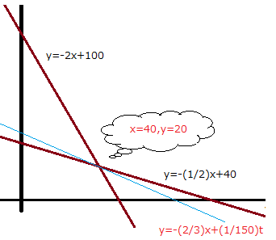

# 6-1. 経営組織論

## SL理論 (Situation Leadership)

| | TaskOriented Low | High |
|:---:|:---:|:---:|
|<b>RelationOriented High</b>| 3.参加型 | 2.説得型 |
|<b>Low</b>| 4.委任型 | 1.教示型 |

## JIS Q 22301 社会セキュリティ事業継続マネジメントシステム要求事項

Business Continuity Management Systemを策定し、運用するための要求事項

# 6-2. OR/IE

## 線形計画法

## ゲーム理論

- Maxi-Min 消極的
- Maxi-Max 積極的
- Mini-Max 消極的

## 品質管理手法

### QC七つ道具

### 新QC七つ道具

c管理図

~x管理図

親和図

デルファイ法・・多くの専門家に繰り返し同一のアンケートをとって意見を収斂・集約させる技法。（未来予測）
ゴードン法・・抽象的なテーマによるブレインストーミング

---
[次の章](./07_LegalAffairs.md)
